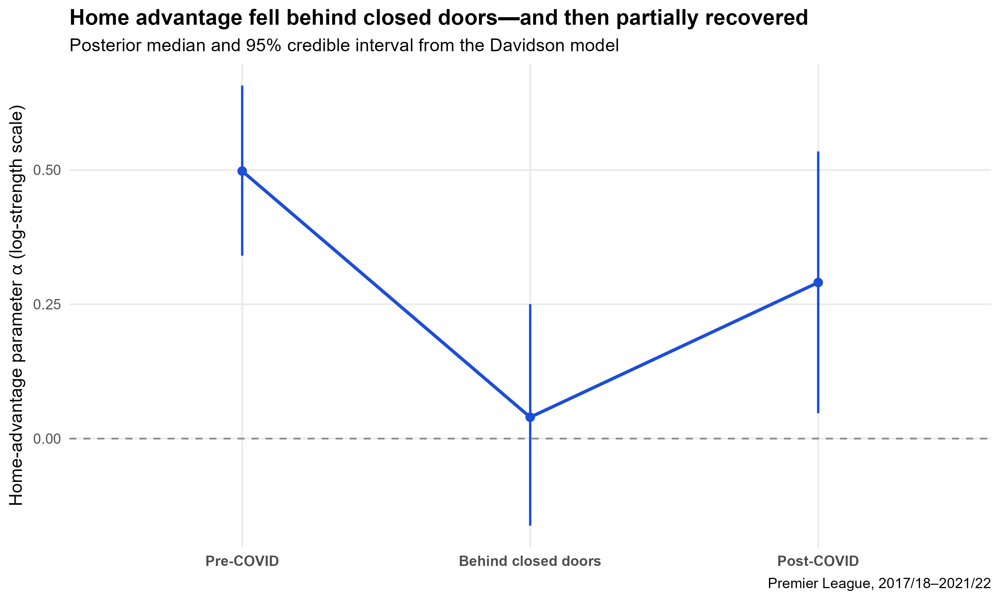
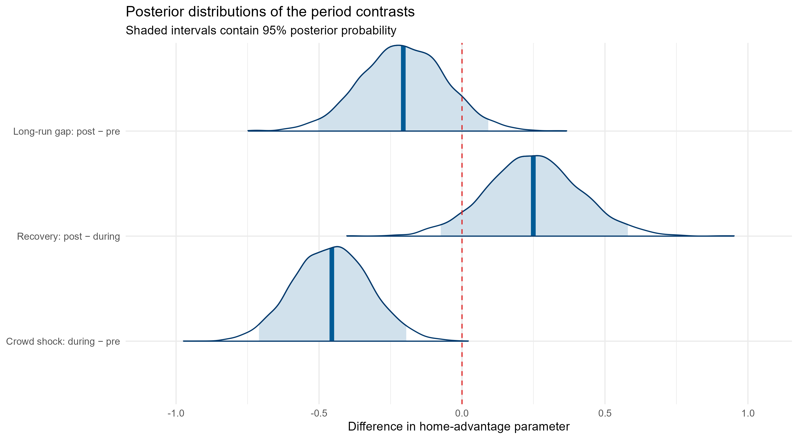
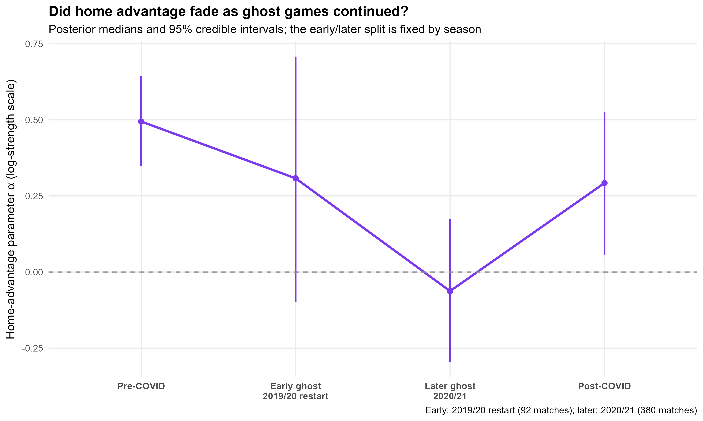
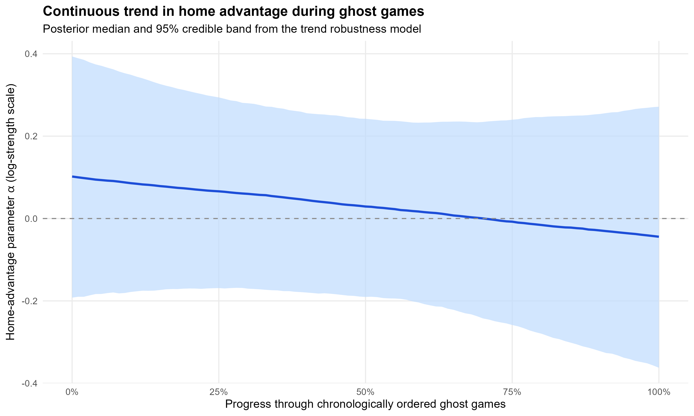
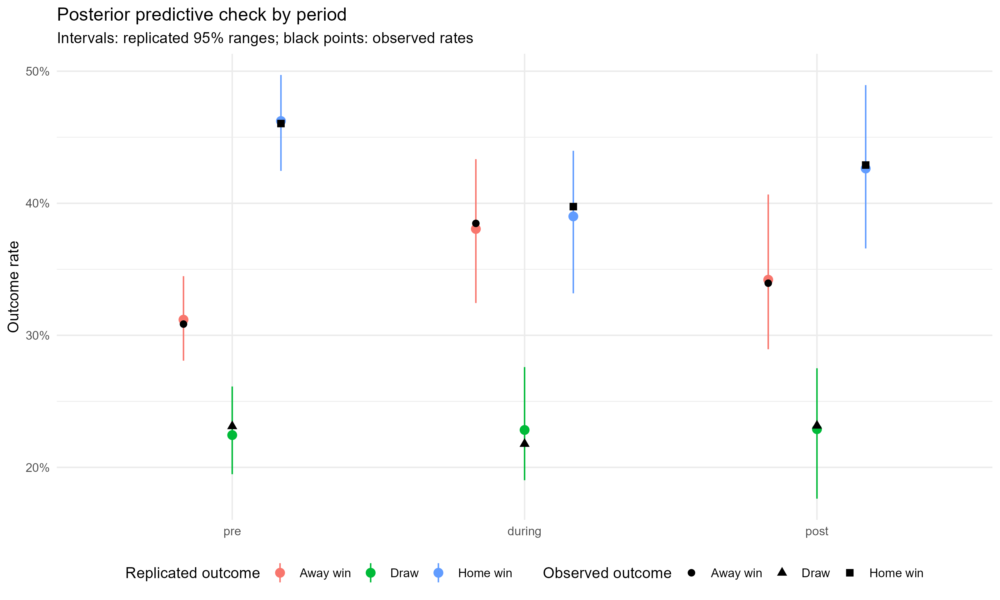

# What Is a Premier League Crowd Worth?

> Home advantage, the consistent tendency for teams competing on their own ground to outperform their away record, is one
of the most robust empirical regularities in team sports. During the COVID, empty stadiums created a quasi-natural experiment. Across 1,900 Premier League matches, a Bayesian Davidson model finds greater than 99.9% posterior probability that home advantage fell during pandemic-era attendance restrictions.



_Posterior medians and 95% credible intervals. Home advantage fell sharply during the restricted-attendance period and partially recovered in 2021/22._

## Research question

Did playing behind closed doors reduce home advantage in the English Premier League, and did that advantage return when supporters came back?

The COVID-19 shutdown provides a quasi-natural experiment. Stadium access changed abruptly for external reasons to any individual club or match. Comparing league competition before, during, and after this disruption helps separate the crowd-related component of home advantage from stable features such as travel, pitch familiarity, and club identity.

The interpretation is causal only under the assumption that no other period-specific shock changed home and away performance at the same cutoff in a way the model fails to capture. The analysis therefore provides evidence from a strong natural comparison, not a randomized experiment.

## Data and identification

The analysis contains all 1,900 matches from five complete Premier League seasons, 2017/18 through 2021/22, involving 28 clubs. Match results come from the [Datahub English Premier League dataset](https://datahub.io/football/english-premier-league). The reproducible pipeline retains match date, home and away teams, full-time goals, and the three-way result.

| Period | Date definition | Matches | Home win | Draw | Away win |
|---|---|---:|---:|---:|---:|
| Pre-COVID | Before 2020-03-09 | 1,047 | 46.0% | 23.1% | 30.9% |
| Restricted attendance | 2020-03-09 through 2021-05-23 | 473 | 39.7% | 21.8% | 38.5% |
| Post-COVID | On or after 2021-08-13 | 380 | 42.9% | 23.2% | 33.9% |

The summer interval from 2021-05-24 through 2021-08-12 is outside the analysis periods due to the full lockdown issued by the UK government at the time. Team-level latent strengths adjust for the identities of the home and away clubs. The original date boundaries are retained exactly for comparability with the course analysis.

## Primary model

The main analysis is a Bayesian Bradley-Terry model with Davidson's extension for draws, fitted in Stan through `cmdstanr`. For match $n$, home and away team strengths enter a three-outcome likelihood. Davidson's $\nu$ controls draw propensity, and a period-specific $\alpha$ shifts the home team's latent strength.

The three home-advantage parameters are $\alpha_{pre}$, $\alpha_{during}$, and $\alpha_{post}$. The generated quantities define the substantive contrasts:

$$
\delta_{crowd}=\alpha_{during}-\alpha_{pre},\qquad
\delta_{recovery}=\alpha_{post}-\alpha_{during},\qquad
\delta_{gap}=\alpha_{post}-\alpha_{pre}.
$$

A negative $\delta_{crowd}$ indicates a decline during attendance restrictions. A positive $\delta_{recovery}$ indicates a subsequent rebound, while a negative $\delta_{gap}$ indicates that the post-COVID level remained below the pre-COVID baseline through 2021/22.

The priors are:

- team effects: $\beta_{raw}\sim\mathcal{N}(0,1)$, $\mu_\beta\sim\mathcal{N}(0,1)$, and $\sigma_\beta\sim\mathcal{N}^{+}(0,1)$;
- home advantage: $\alpha_{pre}\sim\mathcal{N}(0.4,0.3)$, $\alpha_{during}\sim\mathcal{N}(0,0.3)$, and $\alpha_{post}\sim\mathcal{N}(0.3,0.3)$;
- draw propensity: $\log\nu\sim\mathcal{N}(0,1)$.

Four chains are run with 1,000 warm-up and 1,000 sampling iterations per chain, producing 4,000 post-warm-up draws.

## Results

### Home advantage fell during attendance restrictions

| Quantity | Posterior median | 95% credible interval | Directional probability |
|---|---:|---:|---:|
| Pre-COVID home advantage, $\alpha_{pre}$ | 0.498 | [0.341, 0.657] | - |
| Restricted-attendance home advantage, $\alpha_{during}$ | 0.040 | [-0.162, 0.250] | - |
| Post-COVID home advantage, $\alpha_{post}$ | 0.291 | [0.047, 0.535] | - |
| Crowd shock, $\delta_{crowd}$ | -0.455 | [-0.710, -0.195] | $P(\delta_{crowd}<0)>99.9\%$ |
| Recovery, $\delta_{recovery}$ | 0.249 | [-0.074, 0.580] | $P(\delta_{recovery}>0)=93.7\%$ |
| Remaining post/pre gap, $\delta_{gap}$ | -0.205 | [-0.503, 0.092] | $P(\delta_{gap}<0)=91.7\%$ |

All quantities are on the model's log-strength scale. The crowd-shock interval lies entirely below zero, providing very strong evidence that home advantage declined during the disruption. The post-COVID estimate is higher than the restricted-attendance estimate with 93.7% posterior probability, supporting a partial rebound. However, the recovery contrast and post/pre gap both retain meaningful uncertainty because their 95% intervals cross zero. The evidence therefore does not establish either complete recovery or a permanent structural decline.

The posterior median of the Davidson draw-propensity parameter is $\nu=0.706$.



### Binary robustness benchmark

`R/03_baseline.R` fits a secondary binary mixed-effects logistic model:

```r
home_win ~ period_f + (1 | HomeTeam) + (1 | AwayTeam)
```

With the restricted-attendance period as the reference, the pre-COVID coefficient is 0.302 with a 95% credible interval of [0.036, 0.565]. The post-COVID coefficient is 0.152 with an interval of [-0.156, 0.471]. This simpler model supports the main finding that pre-COVID home-win odds were higher than during the disruption, while the post-COVID rebound remains less precisely estimated. It is a robustness benchmark rather than the primary analysis because it collapses draws and away wins into one outcome.

## Within-period ghost-game dynamics

A supplementary analysis asks whether home advantage was relatively high when ghost games first began and then fell during the majority of restricted-attendance matches.

The primary extension uses a season-defined split chosen without examining match outcomes:

| Phase | Definition | Matches | Interpretation |
|---|---|---:|---|
| Early ghost | 2019/20 restart, 2020-06-17 through 2020-07-26 | 92 | Initial exposure to empty stadiums |
| Later ghost | 2020/21 season, 2020-09-12 through 2021-05-23 | 380 | Majority of restricted-attendance matches |

The model estimates separate $\alpha_{early\ ghost}$ and $\alpha_{later\ ghost}$ parameters and defines

$$
\delta_{adaptation}=\alpha_{later\ ghost}-\alpha_{early\ ghost}.
$$

The posterior median is $-0.367$, with a 95% credible interval of $[-0.829,\ 0.100]$ and

$$
P(\delta_{adaptation}<0\mid data)=94.1\%.
$$

This provides suggestive evidence that home advantage was lower during the later ghost-game phase, although the 95% interval still crosses zero.



A robustness model replaces the split with a linear change over chronologically ordered ghost games:

$$
\alpha_n=\alpha_{ghost,start}+\gamma_{ghost}t_n,
\qquad 0\leq t_n\leq1.
$$

The trend estimate is $\gamma_{ghost}=-0.142$ with a 95% credible interval of $[-0.592,\ 0.275]$ and $P(\gamma_{ghost}<0)=74.3\%$. The data therefore provide weaker evidence for a smooth linear decline than for the season-defined early/later difference. The pattern may have been nonlinear or related partly to other differences between the two seasons.



## Model checks

The primary Davidson fit shows strong numerical convergence. Across the reported parameters, the maximum R-hat is 1.003 and the minimum bulk effective sample size is approximately 971; the three period parameters and substantive contrasts each have bulk ESS above 5,100. Trace plots show stationary, overlapping chains.

The posterior predictive check compares observed home-win, draw, and away-win rates with replicated rates in each period. Every observed rate falls within its corresponding 95% posterior predictive interval, with observed and replicated centers closely aligned.



Both dynamic models also converged satisfactorily. The maximum R-hat is 1.0063, effective sample sizes are adequate, and neither model produced divergent transitions or maximum-treedepth events. E-BFMI values range from 0.685 to 0.828.

## How to run

Prerequisites are R, a working C++ toolchain, and CmdStan. Windows users need the version of Rtools that matches their installed R version.

Install `cmdstanr` and CmdStan once from R:

```r
install.packages(
  "cmdstanr",
  repos = c(
    "https://stan-dev.r-universe.dev",
    "https://cloud.r-project.org"
  )
)

cmdstanr::install_cmdstan()
```

Clone the repository using GitHub's **Code** menu. Place the five raw season CSVs described in [`data/README.md`](data/README.md) under `data/raw/`, then run from the repository root:

```bash
cd epl-home-advantage
Rscript run_all.R
```

The full pipeline rebuilds the processed data, fits the primary Davidson model, runs the binary robustness benchmark and diagnostics, fits both dynamic extensions, and creates all figures. Because it fits three Stan models, a complete run can take several minutes. Every numbered script can also be sourced independently once its required on-disk inputs exist.

To rerun only the dynamic extension after `data/processed/pl_final.csv` exists:

```r
source("R/06_ghost_dynamics.R")
```

## Repository map

```text
R/00_setup.R                       package, toolchain, and session checks
R/01_data_prep.R                   raw CSVs -> analysis-ready data
R/02_fit_davidson.R                primary three-outcome Davidson model
R/03_baseline.R                    secondary binary robustness benchmark
R/04_diagnostics.R                 R-hat, ESS, trace, and predictive checks
R/05_figures.R                     portfolio figures and posterior summaries
R/06_ghost_dynamics.R              early/later test and continuous trend check
stan/davidson_bt.stan              primary Davidson likelihood and priors
stan/davidson_bt_ghost_split.stan  early versus later ghost games
stan/davidson_bt_ghost_trend.stan  continuous ghost-game trend
```

## Limitations and extensions

- The original 2020-03-09 cutoff is retained for comparability, although the strict behind-closed-doors restart began later and some 2020/21 fixtures admitted limited crowds. The treatment is therefore best interpreted as a pandemic-era restricted-attendance period rather than a uniform zero-attendance condition.
- Pandemic-era changes other than crowd access, including schedule congestion, health protocols, substitution rules, and broader psychological disruption, may also affect the estimated period contrast.
- The early/later split is fixed by the competition calendar rather than selected from the outcomes, but it can still conflate adaptation with other differences between the 2019/20 restart and the 2020/21 season.
- The continuous specification avoids one hard cutoff but assumes a linear trend and yields considerably weaker evidence of decline.
- Team strength is constant across the five-season window. A season-varying or dynamic strength model would better represent transfers, injuries, managerial changes, and promoted or relegated clubs.
- The analysis covers one league and ends in 2021/22, so the estimated post-COVID gap should not be described as permanent.

Natural next steps are to add verified match-level attendance, allow team strength to vary by season, test a flexible nonlinear time curve, and extend the recovery analysis through later Premier League seasons.

## License

Released under the MIT License. Data remain subject to the terms of their original provider.
